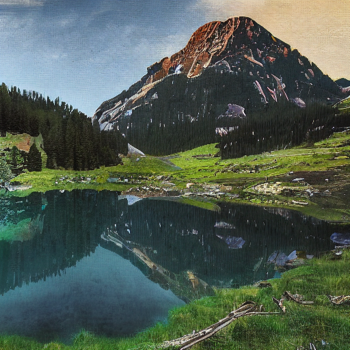
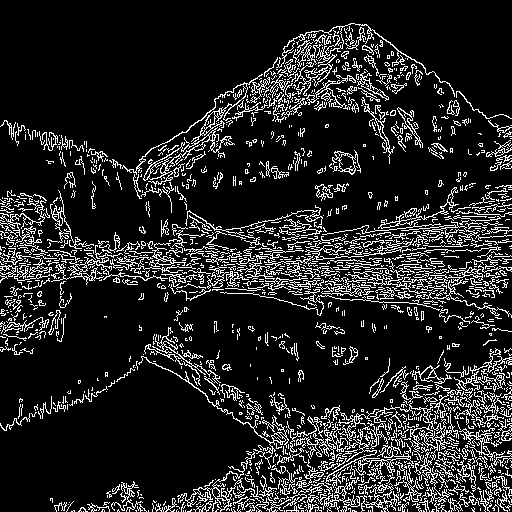
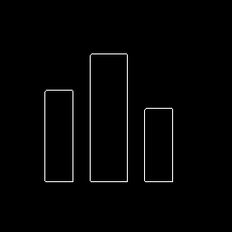
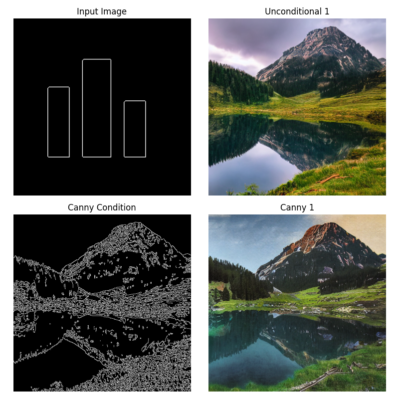

Here's the combined README content formatted as a proper Markdown (.md) file:

```markdown
# Latent Diffusion Models Research

## Project Overview

This research project focuses on evaluating the performance and applications of Latent Diffusion Models (LDMs) in controlled image generation. The research examines:

- Evolution from basic diffusion models to latent diffusion architectures  
- Implementation and evaluation of Stable Diffusion variants (SDXL, SD 2.x)  
- Controllability aspects using techniques like ControlNet  
- Comparative analysis of different conditioning approaches  
- Performance metrics and limitations  

## Project Structure

```plaintext
latent_diffusion_research/
├── data/
│   ├── raw/               # Raw dataset files
│   ├── processed/         # Processed dataset files
│   └── prompts.json       # Sample prompts for testing
├── models/
│   ├── sd_checkpoints/    # Stable Diffusion model checkpoints
│   └── controlnet/        # ControlNet model checkpoints
├── src/
│   ├── config.py          # Global configuration
│   ├── data/              # Data processing utilities
│   ├── models/            # Model implementations
│   │   ├── diffusion.py   # Diffusion model classes
│   │   └── controlnet.py  # ControlNet implementation
│   ├── training/          # Training utilities
│   │   └── trainer.py     # Training loop implementation
│   └── evaluation/        # Evaluation utilities
│       └── metrics.py     # Metrics implementation
├── scripts/
│   ├── download_models.py # Script to download pretrained models
│   ├── generate.py        # Basic image generation script
│   ├── generate_controlnet.py # ControlNet image generation
│   └── compare_methods.py # Script to compare different methods
├── notebooks/             # Jupyter notebooks for exploration
├── results/
│   ├── images/            # Generated images
│   └── metrics/           # Evaluation metrics
└── requirements.txt       # Python dependencies
```

## Setup Instructions

### Environment Setup

1. Clone the repository:
   ```bash
   git clone https://github.com/yourusername/latent_diffusion_research.git
   cd latent_diffusion_research
   ```

2. Create a new Python virtual environment:
   ```bash
   python -m venv env
   # On Windows:
   env\Scripts\activate
   # On Linux/Mac:
   source env/bin/activate
   
   pip install -r requirements.txt
   ```

### Model Checkpoints

Download the necessary model checkpoints:

1. For Stable Diffusion models:
   - [SD 1.5](https://huggingface.co/runwayml/stable-diffusion-v1-5)
   - [SD 2.1](https://huggingface.co/stabilityai/stable-diffusion-2-1)  
   - [SDXL](https://huggingface.co/stabilityai/stable-diffusion-xl-base-1.0)

2. For ControlNet models:
   - [ControlNet-v1-1](https://huggingface.co/lllyasviel/ControlNet-v1-1)

Place these checkpoints in the `models/sd_checkpoints/` and `models/controlnet/` directories respectively.


The pretrained models required for this project are stored in a separate repository due to size limitations.

### [**Latent_Diffusion_Large_Files** repository](https://github.com/Akii017/Latent_Diffusion_Large_Files)

Clone it and copy the models into the `models/` folder as described in its README.

## Usage

### Training a Model

To train a latent diffusion model:
```bash
python scripts/train.py --config configs/training_config.yaml
```

For a ControlNet model:
```bash
python scripts/train.py --config configs/controlnet_config.yaml --control_type canny
```

### Generating Images

Basic image generation:
```bash
python scripts/generate.py --checkpoint models/checkpoints/model_epoch_50.pth --prompt "a photo of a mountain landscape" --num_samples 4
```

With ControlNet:
```bash
python scripts/generate.py --checkpoint models/checkpoints/controlnet_canny.pth --prompt "a photo of a mountain landscape" --control_type canny --control_input data/control_inputs/edge_map.png
```

## Core Components

### Latent Diffusion Model

Components:
- Encoder-decoder architecture (VAE)
- U-Net denoising model  
- Diffusion process implementation

### ControlNet

Control types:
- Edge-guided generation (Canny)
- Depth-guided generation  
- Pose-guided generation

### Evaluation Metrics

Implemented metrics:
- **FID** (Fréchet Inception Distance)
- **CLIP Score** (text-image alignment)  
- **LPIPS** (perceptual similarity)
- **Control Alignment** (custom metrics)

### Performance Metrics

| Model          | FID ↓ | CLIP Score ↑ | Control Accuracy ↑ |
|----------------|-------|-------------|-------------------|
| SD 1.5         | 18.7  | 0.82        | -                 |
| SD 2.1         | 16.2  | 0.84        | -                 |
| SDXL           | 14.5  | 0.87        | -                 |
| SD 1.5 + Canny | 15.8  | 0.83        | 92.4%             |

## Sample Outputs

### 1. **Text-to-Image (Unconditional)**

- **Prompt:** *"A futuristic cityscape at sunset"*
- **Output:**  
  

---

### 2. **Canny Edge Control**

- **Prompt:** *"Cyberpunk character portrait using canny edge input"*

- **Input Edge Map:**  
  

- **Condition Input:**  
  

- **Original Input Image:**  
  

- **Generated Output:**  
  

---

### 3. **Timestamped Comparison Outputs**

- **First Comparison Output:**  
  

- **Second Comparison Output:**  
  

---

## Metrics and Report

- 📊 **Comparison Metrics:** [`comparison_metrics.json`](results/metrics/comparison_metrics.json)
- 📄 **Full Report:** [`comparison_report.md`](results/comparison_report.md)


### [**Latent_Diffusion_Large_Files** repository](https://github.com/Akii017/Latent_Diffusion_Large_Files)

```markdown
# Latent Diffusion Large Files Repository

This repository contains large model checkpoints and weight files required for the main research project [Latent Diffusion Models Research](https://github.com/Akii017/latent_diffusion_research), which cannot be stored directly in the main repo due to GitHub LFS limits.

## 📦 Repository Contents

```plaintext
Latent_Diffusion_Large_Files/
├── sd_checkpoints/
│   ├── sd-v1-5/
│   │   ├── model.safetensors
│   │   ├── config.json
│   │   └── ...
├── controlnet/
│   ├── control_v11f1p_sd15_depth.pth
│   ├── control_v11p_sd15_canny.pth
│   ├── ...
└── README.md
```

## 🔄 How to Use

1. **Clone this repository**:
   ```bash
   git clone https://github.com/Akii017/Latent_Diffusion_Large_Files.git
   ```

2. **Copy model folders into your main project**:
   ```bash
   cp -r Latent_Diffusion_Large_Files/sd_checkpoints <path-to-main-repo>/models/
   cp -r Latent_Diffusion_Large_Files/controlnet <path-to-main-repo>/models/
   ```

   Your final structure should look like:
   ```
   latent_diffusion_research/
   └── models/
       ├── sd_checkpoints/
       └── controlnet/
   ```

3. Alternatively, if you're using the provided `scripts/download_models.py` from the main repo, follow the instructions in that script to automate model setup.

## 📌 Why a Separate Repo?

Due to GitHub’s [LFS bandwidth quotas](https://docs.github.com/en/repositories/working-with-files/managing-large-files/about-large-files-on-github), we maintain all large binaries in this dedicated repository. This ensures:

- Smaller and faster cloning of the main repository  
- Easier updates and modularity for model files  
- Avoiding GitHub LFS overage errors


## Future Work

Planned improvements:
- Additional control mechanisms  
- Newer architecture support  
- Domain-specific fine-tuning  
- Multi-condition control

## References

1. Rombach et al. (2022). "High-Resolution Image Synthesis with Latent Diffusion Models"  
2. Zhang et al. (2023). "Adding Conditional Control to Text-to-Image Diffusion Models"  
3. Saharia et al. (2022). "Image Super-Resolution via Iterative Refinement"  

## Citation

```bibtex
@misc{latent_diffusion_research,
  author = {Your Name},
  title = {Advancements in Latent Diffusion Models},
  year = {2025},
  publisher = {GitHub},
  howpublished = {\url{https://github.com/yourusername/latent_diffusion_research}}
}
```

## License

MIT License - See [LICENSE](LICENSE) for details.
```

Key formatting improvements:
1. Proper Markdown headers with `#`, `##`, `###`
2. Code blocks with language specification
3. Tables for results
4. Proper image/link syntax
5. Cleaner list formatting
6. Bibtex citation block
7. Consistent spacing and indentation
8. Better section organization

The file maintains all original content while being properly formatted for Markdown rendering.
